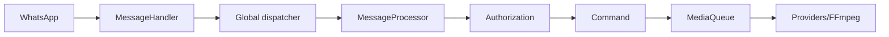

<!-- locale: ar; docs-version: 1 -->
# البنية

المسار الرئيسي هو WhatsApp -> `MessageHandler` -> dispatcher عام -> `messageProcessor` -> التفويض -> الأمر. تعمل 10 رسائل بالتوازي دون ترتيب للمحادثة، ويمكن أن تنتظر 200. تستمر الوسائط في الخلفية عبر `MediaQueue`.

الأوامر في `src/commands`، والأحداث في `src/events`، وقواميس i18n في `src/i18n`، والتخزين الذري في `src/storage`. يقوم lifecycle بإزالة listeners وتفريغ الطوابير وإغلاق socket.

يستخدم YouTube providers منفصلة مع retry وcooldown وfallback. التنزيل streaming. يحدد auto-update commit دقيقًا من `main`، ويفحص staging، وينشئ backup وrollback. يعرض `statusbot` المقاييس المجمعة.

للتوسعة طبّق `Command` أو `Event` أو `YouTubeProvider`، وأضف مفاتيح إلى ملفات i18n الأحد عشر واختبارات في `tests/`، ثم شغّل `npm run verify`.
