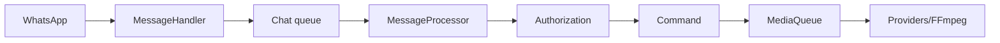

<!-- locale: bn; docs-version: 1 -->
# আর্কিটেকচার

মূল flow WhatsApp -> `MessageHandler` -> প্রতি-chat queue -> `messageProcessor` -> authorization -> command। একই chat-এর ক্রম অক্ষুণ্ণ থাকে, আলাদা chat সমান্তরালে চলে। ভারী কাজ `MediaQueue`-তে যায়, যা concurrency, timeout ও FFmpeg সীমিত করে।

Commands `src/commands`, events `src/events`, i18n dictionaries `src/i18n` এবং atomic storage `src/storage`-এ। Lifecycle listeners সরায়, queues drain করে ও socket বন্ধ করে।

YouTube আলাদা providers, retry, cooldown ও fallback ব্যবহার করে। Downloads streaming-এর মাধ্যমে temporary file-এ যায়। auto-update নির্দিষ্ট `main` commit বেছে staging validate, backup ও rollback করে। `statusbot` aggregated metrics দেখায়।

বর্ধিত করতে `Command`, `Event` বা `YouTubeProvider` implement করুন, 11 i18n file-এ key, `tests/`-এ test যোগ করুন এবং `npm run verify` চালান।
