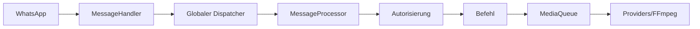

<!-- locale: de; docs-version: 1 -->
# Architektur

Der Hauptfluss lautet WhatsApp -> `MessageHandler` -> globaler Dispatcher -> `messageProcessor` -> Autorisierung -> Befehl. Bis zu 10 Nachrichten laufen parallel ohne Chat-Reihenfolge; 200 können warten. Medien laufen über `MediaQueue` im Hintergrund weiter.

Befehle liegen in `src/commands`, Events in `src/events`, i18n-Dateien in `src/i18n`, atomare Speicherung in `src/storage`. Lifecycle entfernt Listener, leert Queues und schließt den Socket.

YouTube verwendet getrennte Provider mit Retry, Cooldown und Fallback. Downloads werden gestreamt. auto-update fixiert einen `main`-Commit, prüft Staging, erstellt Backups und führt Rollback aus. `statusbot` zeigt aggregierte Metriken.

Neue Funktionen folgen `Command`, `Event` oder `YouTubeProvider`; Übersetzungen müssen in alle 11 i18n-Dateien und Tests nach `tests/`. Vor einem PR `npm run verify` ausführen.
