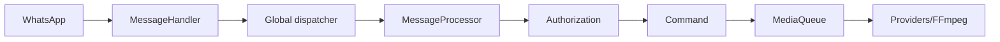

<!-- locale: en; docs-version: 1 -->
# Architecture

The main flow is WhatsApp -> `MessageHandler` -> global dispatcher -> `messageProcessor` -> authorization -> command. Up to 10 messages run concurrently with no per-chat ordering; up to 200 wait in the backlog. Media commands continue in the background through `MediaQueue`.

Commands live in `src/commands`, events in `src/events`, i18n dictionaries in `src/i18n`, and atomic persistence in `src/storage`. Lifecycle cleanup removes listeners, drains queues, flushes JSON/cache writes, and closes the socket.

YouTube uses independent providers with retry, cooldown, and fallback. Downloads stream to temporary files. The auto-update resolves an exact `main` commit, validates staging, creates a backup, and rolls back on failure. Aggregated metrics are exposed through `statusbot`.

To extend Misa, implement `Command`, follow an existing `Event`, add matching keys to all 11 i18n files, implement `YouTubeProvider`, and place tests under `tests/`. Run `npm run verify` and focused mutation tests before submitting changes.
