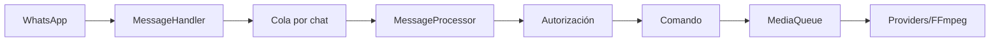

<!-- locale: es; docs-version: 1 -->
# Arquitectura

El flujo es WhatsApp -> `MessageHandler` -> cola por chat -> `messageProcessor` -> autorización -> comando. Un chat conserva orden y varios chats avanzan en paralelo. Las tareas pesadas entran en `MediaQueue`, que limita concurrencia, timeout y FFmpeg.

Los comandos están en `src/commands`, eventos en `src/events`, diccionarios i18n en `src/i18n` y persistencia atómica en `src/storage`. El lifecycle elimina listeners, drena colas y cierra el socket.

YouTube usa providers independientes con retry, cooldown y fallback. Los archivos se descargan por streaming. El auto-update fija un commit de `main`, valida staging, guarda backup y hace rollback. `statusbot` muestra métricas agregadas.

Para extender: implementa `Command`, sigue un `Event`, agrega claves en los 11 archivos i18n, implementa `YouTubeProvider` y crea pruebas en `tests/`. Ejecuta `npm run verify` antes de un PR.
