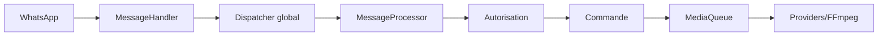

<!-- locale: fr; docs-version: 1 -->
# Architecture

Le flux principal est WhatsApp -> `MessageHandler` -> dispatcher global -> `messageProcessor` -> autorisation -> commande. Jusqu’à 10 messages avancent en parallèle sans ordre par chat ; 200 peuvent attendre. Les médias continuent en arrière-plan via `MediaQueue`.

Les commandes sont dans `src/commands`, les événements dans `src/events`, les dictionnaires i18n dans `src/i18n` et le stockage atomique dans `src/storage`. Le lifecycle retire les listeners, vide les files et ferme le socket.

YouTube utilise des providers séparés avec retry, cooldown et fallback. Les téléchargements sont streamés. L’auto-update fixe un commit de `main`, valide un staging, sauvegarde et effectue un rollback. `statusbot` expose les métriques agrégées.

Pour étendre Misa : implémentez `Command`, suivez un `Event`, ajoutez les clés aux 11 fichiers i18n, implémentez `YouTubeProvider`, écrivez les tests dans `tests/` et lancez `npm run verify`.
