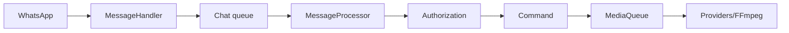

<!-- locale: hi; docs-version: 1 -->
# आर्किटेक्चर

मुख्य flow WhatsApp -> `MessageHandler` -> प्रति-chat queue -> `messageProcessor` -> authorization -> command है। एक chat का क्रम सुरक्षित रहता है और अलग chats समानांतर चलते हैं। भारी काम `MediaQueue` में जाते हैं, जो concurrency, timeout और FFmpeg सीमित करती है।

Commands `src/commands`, events `src/events`, i18n dictionaries `src/i18n` और atomic storage `src/storage` में हैं। Lifecycle listeners हटाकर queues drain करता है और socket बंद करता है।

YouTube अलग providers, retry, cooldown और fallback उपयोग करता है। Download streaming से temporary files में होता है। auto-update `main` commit तय करता है, staging जाँचता है, backup और rollback करता है। `statusbot` aggregated metrics दिखाता है।

विस्तार के लिए `Command`, `Event` या `YouTubeProvider` लागू करें, सभी 11 i18n files में key और `tests/` में test जोड़ें, फिर `npm run verify` चलाएँ।
