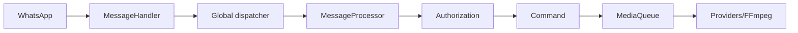

<!-- locale: hi; docs-version: 1 -->
# आर्किटेक्चर

मुख्य flow WhatsApp -> `MessageHandler` -> global dispatcher -> `messageProcessor` -> authorization -> command है। 10 संदेश बिना chat क्रम के समानांतर चलते हैं और 200 प्रतीक्षा कर सकते हैं। Media `MediaQueue` में background में चलता है।

Commands `src/commands`, events `src/events`, i18n dictionaries `src/i18n` और atomic storage `src/storage` में हैं। Lifecycle listeners हटाकर queues drain करता है और socket बंद करता है।

YouTube अलग providers, retry, cooldown और fallback उपयोग करता है। Download streaming से temporary files में होता है। auto-update `main` commit तय करता है, staging जाँचता है, backup और rollback करता है। `statusbot` aggregated metrics दिखाता है।

विस्तार के लिए `Command`, `Event` या `YouTubeProvider` लागू करें, सभी 11 i18n files में key और `tests/` में test जोड़ें, फिर `npm run verify` चलाएँ।
