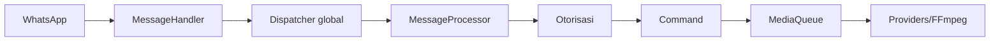

<!-- locale: id; docs-version: 1 -->
# Arsitektur

Alur utama: WhatsApp -> `MessageHandler` -> dispatcher global -> `messageProcessor` -> otorisasi -> command. Hingga 10 pesan diproses paralel tanpa urutan per chat; 200 dapat menunggu. Media berjalan di latar belakang melalui `MediaQueue`.

Command berada di `src/commands`, event di `src/events`, kamus i18n di `src/i18n`, dan penyimpanan atomik di `src/storage`. Lifecycle melepas listener, menguras antrean, dan menutup socket.

YouTube memakai provider terpisah dengan retry, cooldown, dan fallback. Download memakai streaming. auto-update mengunci commit `main`, memvalidasi staging, membuat backup, dan rollback saat gagal. `statusbot` menampilkan metrik agregat.

Untuk menambah fitur, implementasikan `Command`, ikuti contoh `Event`, tambah key di 11 file i18n, implementasikan `YouTubeProvider`, dan tulis test di `tests/`. Jalankan `npm run verify` sebelum PR.
