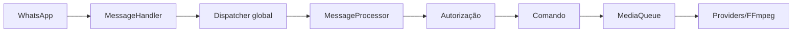

<!-- locale: pt; docs-version: 1 -->
# Arquitetura

O fluxo principal é WhatsApp -> `MessageHandler` -> dispatcher global -> `messageProcessor` -> autorização -> comando. Até 10 mensagens avançam em paralelo, sem garantia de ordem por chat; até 200 aguardam no backlog. Comandos de mídia passam pela `MediaQueue` em segundo plano.

Comandos ficam em `src/commands`, eventos em `src/events`, traduções i18n em `src/i18n` e persistência atômica em `src/storage`. O lifecycle remove listeners, drena filas e fecha o socket. O cache de grupo é reconstruído a cada conexão.

O YouTube usa providers separados e fallback com retry/cooldown. Downloads são streaming para temporários. O auto-update resolve um commit da `main`, valida em staging, cria backup e faz rollback. Métricas agregadas aparecem em `statusbot`.

Para contribuir: copie um comando existente e implemente `Command`; crie eventos seguindo `Event`; adicione a mesma chave nos 11 arquivos i18n; providers implementam `YouTubeProvider`; testes ficam em `tests/`. Execute `npm run verify` e `npm run test:mutation` antes do PR.
