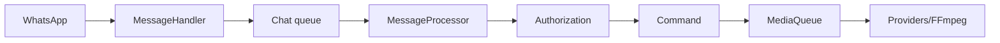

<!-- locale: tr; docs-version: 1 -->
# Mimari

Ana akış WhatsApp -> `MessageHandler` -> chat başına kuyruk -> `messageProcessor` -> yetkilendirme -> command şeklindedir. Aynı chat sıralı kalır, farklı chat'ler paralel ilerler. Ağır işler concurrency, timeout ve FFmpeg sınırlarını uygulayan `MediaQueue` üzerinden geçer.

Command dosyaları `src/commands`, event'ler `src/events`, i18n sözlükleri `src/i18n`, atomik storage `src/storage` altındadır. Lifecycle listener'ları kaldırır, kuyrukları boşaltır ve socket'i kapatır.

YouTube ayrı providers, retry, cooldown ve fallback kullanır. Downloads streaming ile geçici dosyaya yazılır. auto-update kesin bir `main` commit'i seçer, staging doğrular, backup ve rollback yapar. `statusbot` toplu metrikleri gösterir.

Genişletmek için `Command`, `Event` veya `YouTubeProvider` uygulayın; 11 i18n dosyasına key, `tests/` altına test ekleyin ve `npm run verify` çalıştırın.
