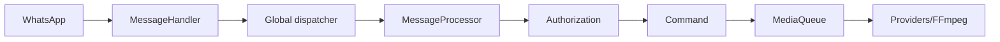

<!-- locale: ur; docs-version: 1 -->
# آرکیٹیکچر

مرکزی flow WhatsApp -> `MessageHandler` -> global dispatcher -> `messageProcessor` -> authorization -> command ہے۔ 10 پیغامات chat ترتیب کے بغیر متوازی چلتے ہیں اور 200 منتظر رہ سکتے ہیں۔ Media `MediaQueue` میں background میں چلتا ہے۔

Commands `src/commands`، events `src/events`، i18n dictionaries `src/i18n` اور atomic storage `src/storage` میں ہیں۔ Lifecycle listeners ہٹاتا، queues drain کرتا اور socket بند کرتا ہے۔

YouTube الگ providers، retry، cooldown اور fallback استعمال کرتا ہے۔ Downloads streaming سے ہوتے ہیں۔ auto-update `main` commit مقرر کرتا، staging validate کرتا، backup اور rollback کرتا ہے۔ `statusbot` aggregated metrics دکھاتا ہے۔

توسیع کے لیے `Command`، `Event` یا `YouTubeProvider` implement کریں، تمام 11 i18n files میں key، `tests/` میں tests شامل کریں اور `npm run verify` چلائیں۔
